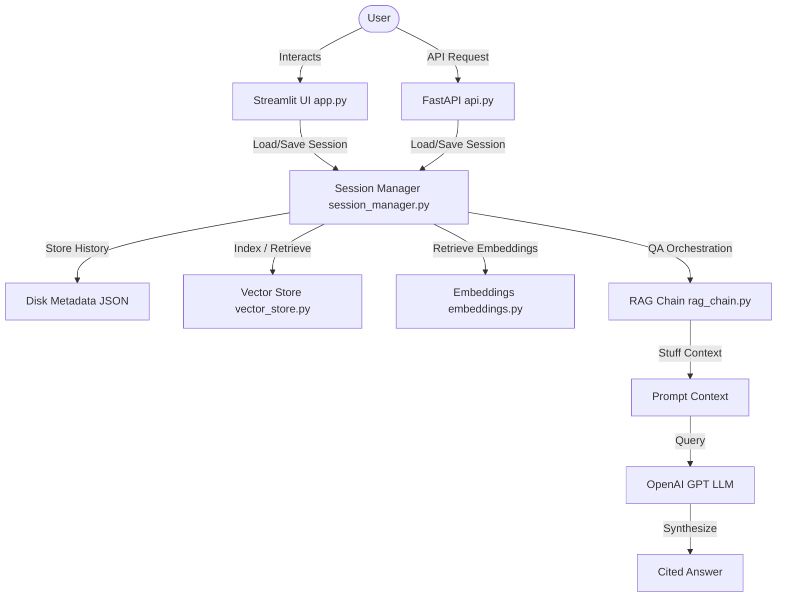

# 📄 RAG PDF Chatbot

A production-ready Retrieval-Augmented Generation (RAG) system running a Streamlit UI frontend and a FastAPI REST API backend. It features multi-tenant session isolation, local vector/metadata persistence, and source document citation tracking.

---

## 🏗️ System Architecture



---

## ✨ Features
* **Dual Interface:** Chat through the interactive Streamlit UI, or execute headless queries programmatically via the FastAPI REST API.
* **Source Tracking:** Citations returned with every query, pointing to the exact source document name, page number, and text preview.
* **Persistent Sessions:** Sessions survive server restarts by automatically caching vector stores (FAISS) and chat history metadata JSONs to disk.
* **Security Safeguards:** Validates session ID formats (UUID4) on all file and directory reads/writes, preventing path traversal attacks.
* **Key-Safety Guards:** Suppresses crash-on-import behavior in test and build environments when the `OPENAI_API_KEY` is not present.

---

## 🚀 Local Setup

### 1. Install Dependencies
```bash
pip install -r requirements.txt
```

### 2. Configure Environment
Rename `.env.example` to `.env` and configure your API keys:
```env
OPENAI_API_KEY=your_openai_api_key_here
LLM_MODEL=gpt-3.5-turbo
EMBEDDING_MODEL=text-embedding-ada-002
VECTOR_DB_TYPE=faiss
```

### 3. Start the API Backend
```bash
uvicorn api:app --reload --port 8000
```
* Interactive API Documentation will be available at `http://localhost:8000/docs` (Swagger UI).

### 4. Start the Streamlit UI
```bash
streamlit run app.py
```
* UI interface will open at `http://localhost:8501`.

---

## 📡 REST API Documentation

### `POST /upload`
Uploads multiple documents (PDF, DOCX, TXT, HTML) to initialize a vector indexing session.
* **Payload:** `multipart/form-data` with files.
* **Response:**
  ```json
  {
    "session_id": "e305e709-a1cb-4bc1-9f9b-134262174c89",
    "message": "Successfully processed 2 files into 42 chunks."
  }
  ```

### `POST /ask/{session_id}`
Asks a question relative to the documents uploaded for the specified session.
* **Request Body:**
  ```json
  {
    "question": "What is the company's revenue forecast?"
  }
  ```
* **Response:**
  ```json
  {
    "answer": "The revenue forecast is...",
    "sources": [
      {
        "filename": "Q3_Report.pdf",
        "page": 4,
        "text_preview": "Based on our segment analysis, Q3 revenue..."
      }
    ]
  }
  ```

### `GET /session/{session_id}`
Retrieves session metadata, document statistics, and conversation length.
* **Response:**
  ```json
  {
    "session_id": "e305e709-a1cb-4bc1-9f9b-134262174c89",
    "history_length": 3,
    "documents_loaded": 42
  }
  ```

---

## 🧪 Testing

Run mock unit and integration tests using pytest:
```bash
pytest tests/
```

---

## 🐳 Docker Deployment

The application is containerized into a dual-container network using Docker Compose.

1. Ensure your `.env` contains your `OPENAI_API_KEY`.
2. Build and run the containers:
   ```bash
   docker-compose up --build -d
   ```
3. UI service runs on `http://localhost:8501`.
4. API docs service runs on `http://localhost:8000/docs`.
